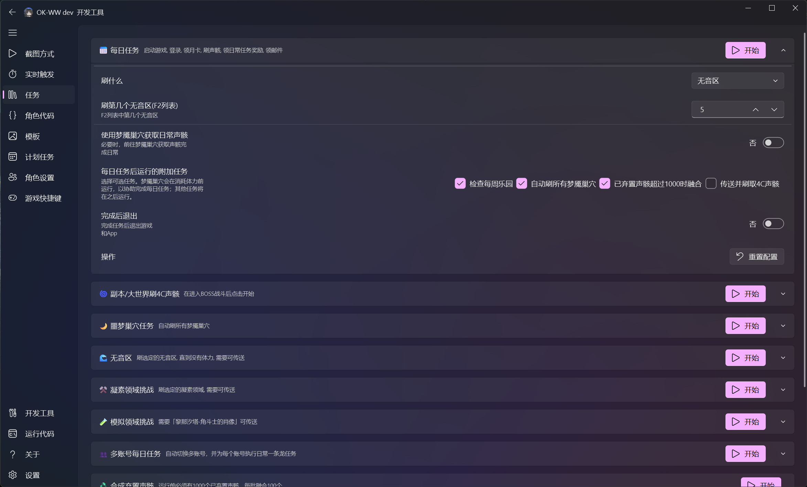
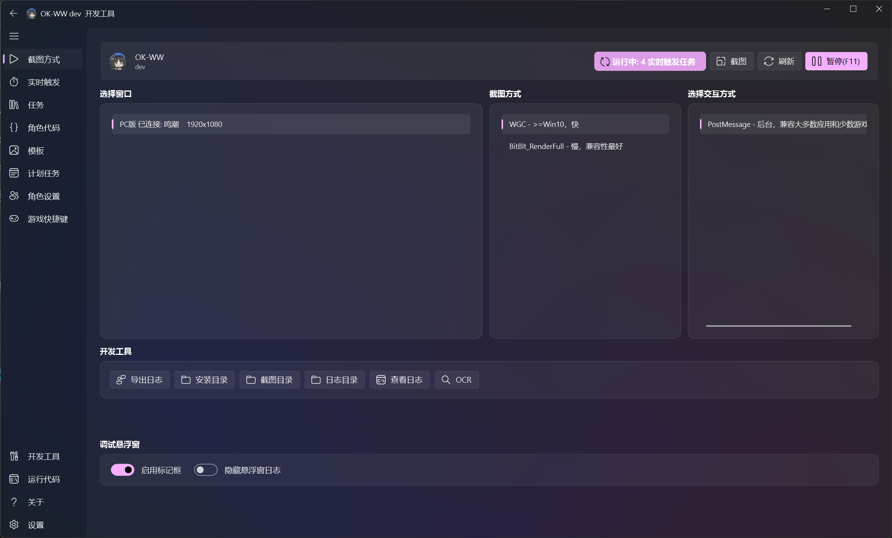
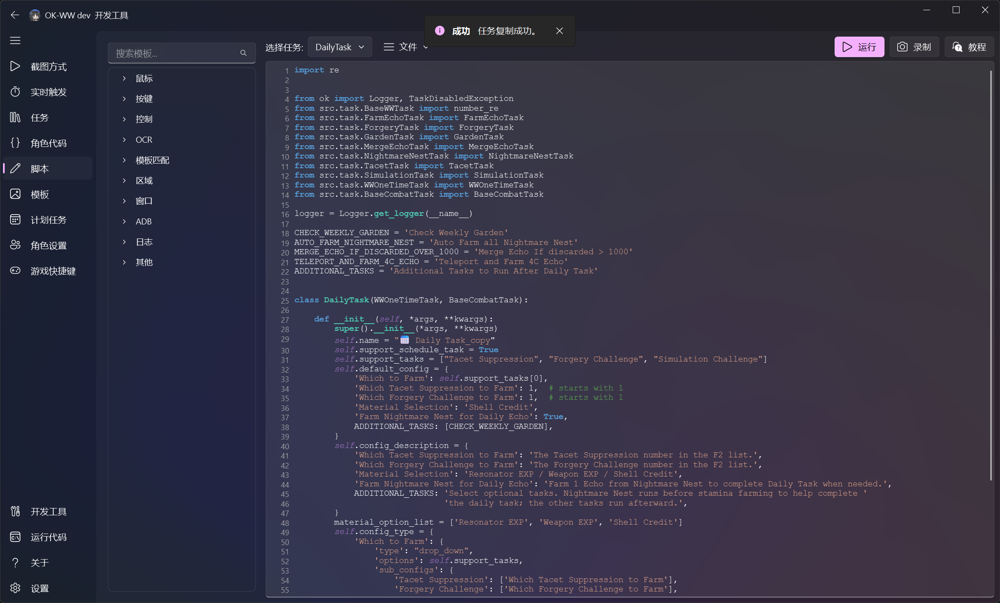
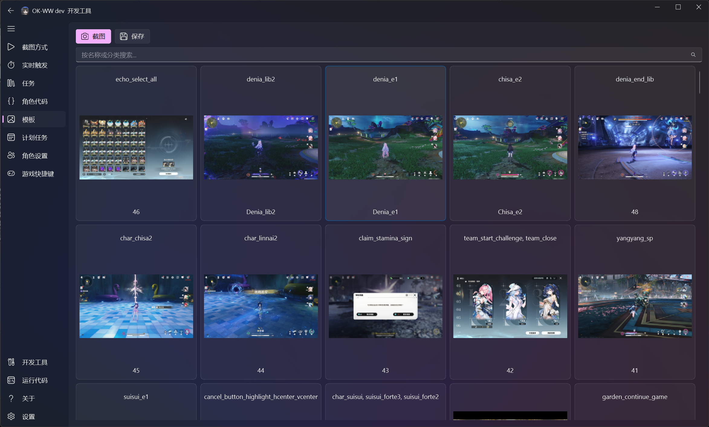

# ok-script

[简体中文](README.md) | **English**

[](https://discord.gg/vVyCatEBgA)

A Python computer-vision automation framework for Windows applications, Windows games, Android emulators, and ADB devices.

ok-script provides a desktop UI, screen capture and input, device control, OCR, template matching, visual debug overlays, automated testing, packaging, and incremental updates. It uses the COCO format to manage template assets and supports resolution-independent matching and localized interfaces.

## Features

- Pure Python and open source, with access to the full pip ecosystem
- One task implementation can support Windows clients, Android emulators, and ADB devices
- OCR, OpenCV template matching, and integration with vision frameworks such as YOLO
- COCO-based template asset management with automatic resolution scaling
- Built-in capture, input, device control, and visual debugging tools
- Automated tests, GitHub Actions builds, and installer publishing
- Internationalization and online incremental updates

## Installation

ok-script supports Python 3.11 and later. Python 3.12 is recommended.

```powershell
python -m pip install ok-script
```

To build a complete automation application, start with the [`ok-script-app`](https://github.com/ok-oldking/ok-script-app) template instead of adding application-specific code to this repository.

## Documentation

Visit the [English documentation hub](docs/en/index.md), or follow this path:

1. [Introduction to game automation](docs/en/intro_to_automation.md)
2. [Quick start](docs/en/quick_start.md)
3. [Advanced guide](docs/en/advanced.md)
4. [API reference](docs/en/api_reference.md)

For a visual scripting experience built on ok-script, see [`ok-py`](https://github.com/ok-oldking/ok-py).

## Screenshots

| Task configuration | Capture and interaction |
| --- | --- |
|  |  |

| Scripting and APIs | Template management |
| --- | --- |
|  |  |

[Read the complete interface and developer-tools guide](docs/en/interface.md), including the template-matching debug overlay.

## Projects built with ok-script

- [ok-script App Template](https://github.com/ok-oldking/ok-script-app)
- [Wuthering Waves](https://github.com/ok-oldking/ok-wuthering-waves)
- [Genshin Impact](https://github.com/ok-oldking/ok-genshin-impact) (unmaintained; background story automation still works)
- [Girls' Frontline 2](https://github.com/ok-oldking/ok-gf2)
- [Honkai: Star Rail](https://github.com/Shasnow/ok-starrailassistant)
- [Blue Protocol: Star Resonance](https://github.com/Sanheiii/ok-star-resonance)
- [Duet Night Abyss](https://github.com/BnanZ0/ok-duet-night-abyss)
- [Chaos Zero Nightmare](https://github.com/baoxin1100/ok-kes)
- [Onmyoji](https://github.com/YunLiuZ/ok-Onmyoji)
- [Ash Echoes](https://github.com/ok-oldking/ok-baijing) (unmaintained)
- [Arknights: Endfield](https://github.com/AliceJump/ok-end-field)
- [Neverness to Everness](https://github.com/BnanZ0/ok-nte)

## Community and releases

- Developer QQ group: 938132715
- [Discord](https://discord.gg/vVyCatEBgA)
- [PyPI](https://pypi.org/project/ok-script/)
- [GitHub](https://github.com/ok-oldking/ok-script)

## License

This project is licensed under the [GNU AGPL v3](LICENSE.txt).
