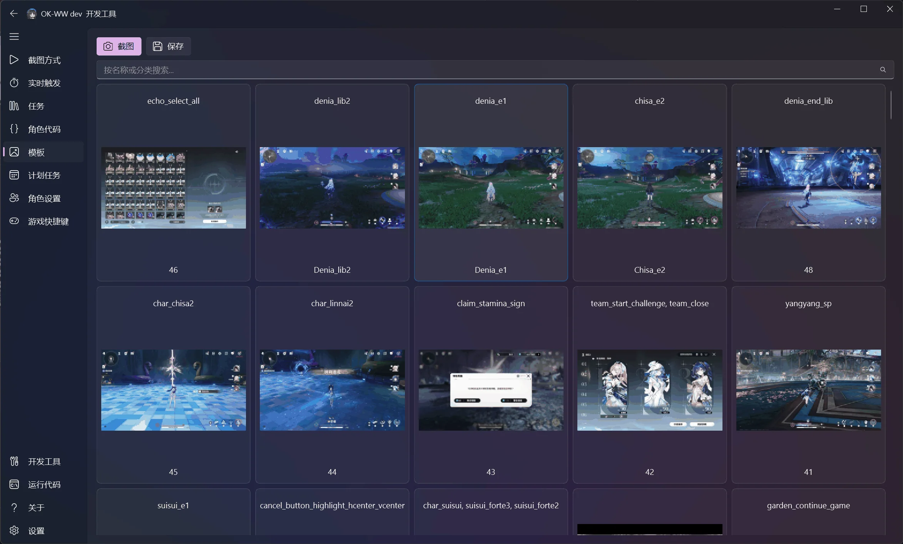
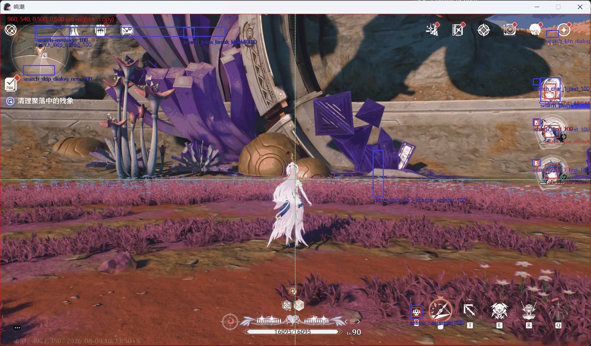

# 界面与开发工具

[English](en/interface.md) · [文档中心](index.md) · [快速开始](quick_start/README.md) · [API 参考](api_doc/README.md)

ok-script 将任务配置、设备连接、脚本开发、模板管理和识别调试集中在同一个桌面界面。本页通过界面截图说明各工具的用途和推荐工作流。

## 任务配置与执行

任务页显示项目提供的单次任务与组合任务。展开任务卡片后可以：

- 修改下拉选项、数字、开关和多选配置；
- 阅读每个配置项的说明；
- 启动单个任务并查看当前状态；
- 重置任务配置；
- 折叠暂时不需要修改的任务。

项目开发者通过 `BaseTask.default_config`、`config_description` 和 `config_type` 定义这些控件。用户不需要修改 Python 代码即可调整运行行为。

## 截图与交互方式

截图方式页用于连接目标并选择截图、输入后端：

1. 在“选择窗口”区域连接 Windows 游戏、模拟器或 ADB 设备。
2. 选择适合目标的截图方式。WGC 通常速度较快，BitBlt 兼容性更好。
3. 选择交互方式，例如适合后台操作的 `PostMessage`。
4. 使用“截图”和“OCR”等开发工具验证画面是否正确。
5. 调试时启用标记框，观察识别区域与结果。

如果画面正常但输入没有响应，请检查交互方式和管理员权限。更多配置步骤参见[快速开始](quick_start/README.md)。

## 脚本与 API 浏览

脚本页将任务源码与常用 API 模板放在同一界面：

- 左侧按鼠标、按键、OCR、模板匹配、ADB 等类别浏览 API；
- 在任务下拉框中切换项目任务；
- 运行或录制脚本，快速验证较小的自动化片段；
- 通过模板插入常见调用，减少手工输入错误。

内置编辑器适合查看和快速实验；较大的代码修改仍建议使用 PyCharm 或 VS Code，并配合自动化测试。

## 模板素材管理

模板页以图片卡片展示 COCO 截图和标注类别。你可以：

- 截取新的模板源图；
- 按名称或类别搜索；
- 查看每张截图包含的识别特征；
- 打开标注工具调整框选区域；
- 保存压缩后的模板素材。

标注时优先使用计划支持的最高分辨率，并选择稳定、具有区分度且不包含动态文字的区域。详细工作流参见[进阶指南](after_quick_start/README.md#1-模板匹配-template-matching)。

## 调试浮层

调试浮层把识别过程直接绘制在捕获画面上：

- 矩形框显示搜索区域和匹配结果；
- 标签显示特征名称、阈值或置信度；
- 中心辅助线用于检查相对坐标和屏幕区域；
- 多个重叠结果可以帮助发现模板过宽、阈值过低或搜索区域不准确等问题。

浮层只用于开发和诊断。正式任务逻辑应依赖 `find_one`、`wait_feature`、`ocr` 等 API 的返回值，而不是浮层状态。

## 推荐工作流

1. 在截图方式页连接目标并验证截图。
2. 在模板页捕获和标注稳定的界面特征。
3. 在脚本页或 IDE 中实现最小识别与点击流程。
4. 启用调试浮层检查搜索区域和匹配结果。
5. 将稳定逻辑封装为任务，并在任务页验证配置体验。
6. 使用固定截图编写回归测试，然后再进行发布构建。
