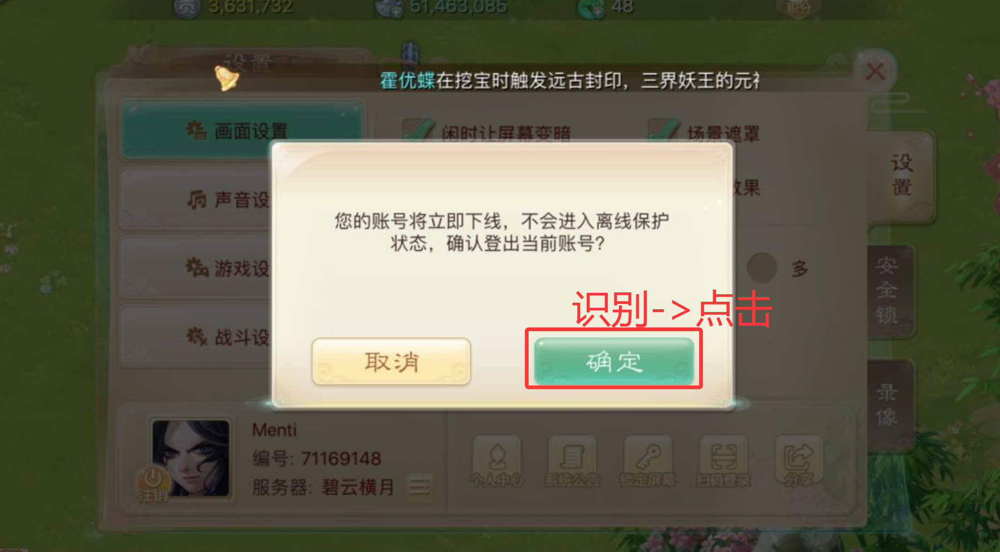
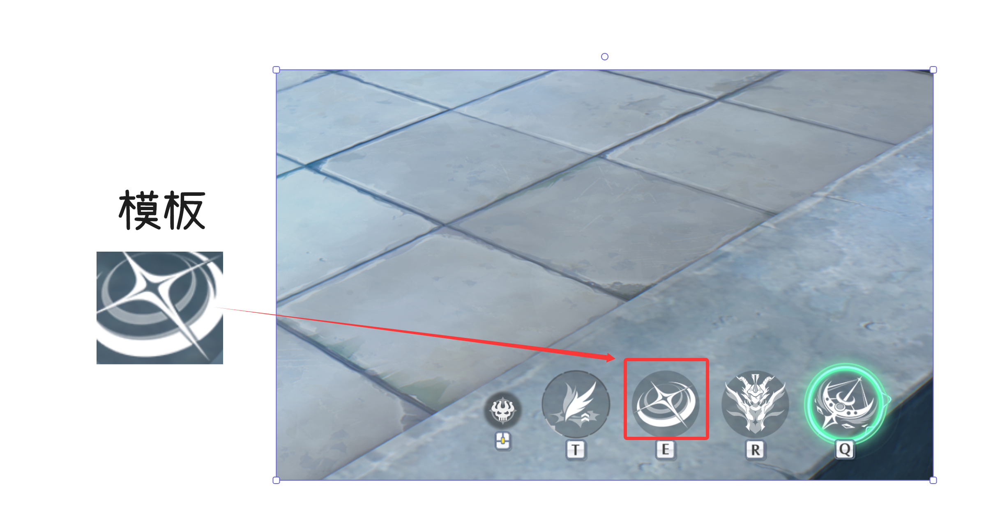
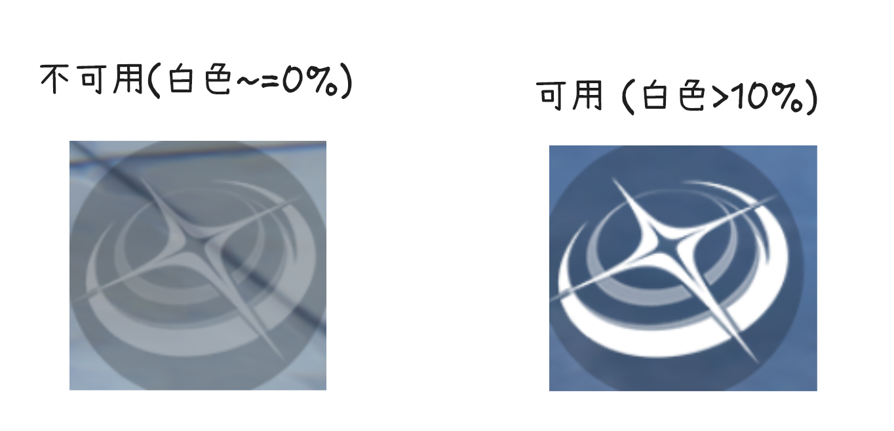
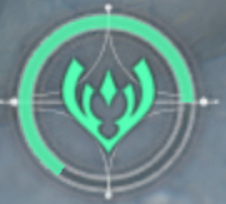
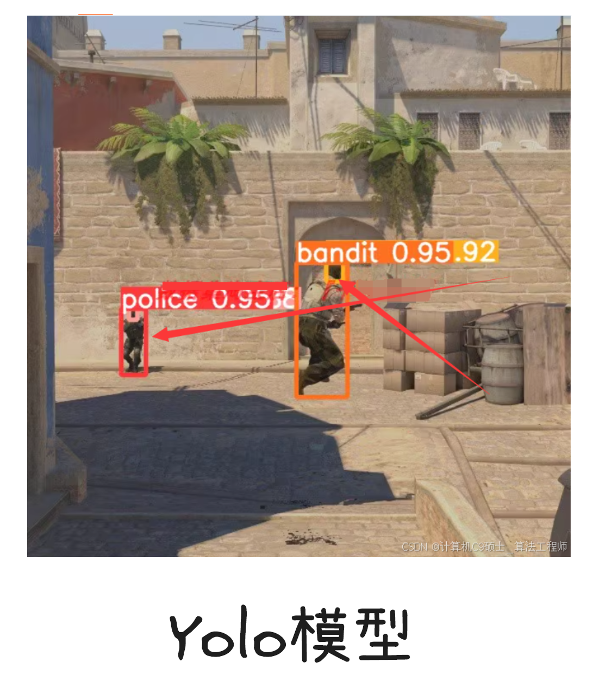
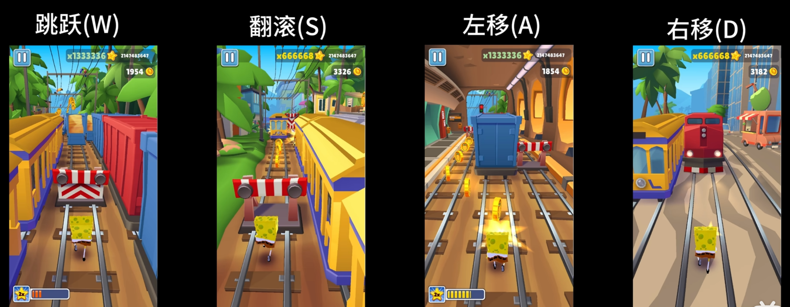

# 基于计算机视觉的游戏自动化入门

本文档旨在为初学者提供一个关于如何使用计算机视觉技术实现游戏自动化的快速入门指南。我们将从基本原理讲起，逐步介绍所需的编程语言和开发工具。

## 目录

- [一、基本原理：计算机如何“玩”游戏](#一基本原理计算机如何玩游戏)
    - [核心循环：三步走](#核心循环三步走)
    - [图像分析：从像素到决策](#图像分析从像素到决策)
        - [传统图色算法 (OpenCV 库)](#1-传统图色算法-opencv-库)
        - [神经网络推理 (Inference)](#2-神经网络推理-inference)
- [二、编程语言选择](#二编程语言选择)
    - [常用库概览](#常用库概览)
- [三、开发工具](#三开发工具)

## 一、基本原理：计算机如何“玩”游戏

基于计算机视觉的游戏自动化，本质上是模拟人类玩家通过“眼睛”观察游戏画面，然后通过“大脑”分析决策，最后通过“手”执行操作的过程。这个过程可以被简化为一个核心循环。

### 核心循环：三步走

**游戏截图 → 图像分析 → 输出操作**

*图：识别确定按钮, 并点击*

1. **输入 (Input) - 游戏截图**：程序首先需要获取游戏的实时画面。
    * **数据量**: 以一张 `1920x1080` 分辨率的屏幕为例，每个像素包含蓝(B)、绿(G)、红(R)三个颜色通道，每个通道的值域为
      0-255（即1个字节）。
    * 计算：`1920 * 1080 * 3 bytes ≈ 6.22 MB`。这意味着每一帧图像都是一个相当大的数据块，因此高效的分析算法至关重要。

2. **处理 (Processing) - 图像分析**：这是整个流程的核心和大脑。程序需要从充满像素点的截图中提取出有意义的信息，以做出决策。主要有两种技术路径。

3. **输出 (Output) - 模拟操作**：根据图像分析的结果，程序会模拟人类玩家的键盘和鼠标操作。这不仅包括立即执行的动作，还包括策略性的等待。
    * **立即操作**: 移动鼠标、点击按钮、按下键盘等，从而与游戏进行交互。
    * **等待操作**: 持续监控游戏画面，直到满足特定条件再执行下一步。例如，程序可以循环截图分析，直到画面中出现“战斗结束”的文字，才进行点击“确定”按钮的操作。

### 图像分析：从像素到决策

我们将图像分析的方法分为两大类：传统的图色算法和现代的神经网络推理。

| 方法 (Method)      | 耗时 (Latency)    | 易用性 (Ease of Use)   | 主要计算单元 (CPU/GPU) |
|:-----------------|:----------------|:--------------------|:-----------------|
| **找色/特征分析**      | 极低 (ms级)        | 高(原理简单) / 中(定制复杂算法) | CPU              |
| **找图 (模板匹配)**    | 1-50ms          | 中 (需要维护模板图片库)       | CPU              |
| **OCR (文字识别)**   | 10-200ms        | 易(有现成模型) / 难(支持多语言) | CPU / GPU        |
| **目标检测 (YOLO等)** | 中~高 (20-500ms+) | 难 (需要自己训练模型)        | CPU / GPU        |
| **多模态大模型**       | 高 (500ms+)      | 难 (付费, 接入远程API)     | GPU / (远程API)    |

#### 1. 传统图色算法 ([OpenCV 库](https://opencv.org/))

这类算法速度快、实现简单，适用于处理界面固定、特征明显的场景。最常用的库是 **OpenCV**。

* **找图 (Template Matching)**
    * **原理**: 在整个游戏截图中，寻找一个预先准备好的小图片（模板），比如一个按钮、一个图标。
    * **应用**: 点击确定的UI按钮、识别特定怪物或道具图标。
      
      *图：在屏幕截图中寻找“设置”按钮的模板*

* **找色 (Color Finding)**
    * **原理**: 在指定区域内寻找特定颜色或颜色范围的像素点。
    * **应用**: 判断角色的血条/蓝条状态、识别高亮的按钮或文字、寻找特定颜色的目标。
      
      *图：通过识别红色来定位敌人的血条*

* **特征分析 (Feature Analysis)**
    * **原理**: 通过轮廓检测、边缘检测等算法，分析图像中特定对象的几何特征。
    * **应用**: 计算读条或技能的进度、判断某个区域是否出现特定形状的物体。
      
      *图：通过计算像素比例来判断进度条的完成度*

#### 2. 神经网络推理 (Inference)

当游戏界面复杂、元素多变或需要识别更抽象的概念时，神经网络模型就派上了用场。这通常需要使用预先训练好的模型进行“推理”。

* **OCR (光学字符识别)**
    * **原理**: 从图像中识别并提取文字信息。
    * **应用**: 读取角色的血量数值、识别NPC对话内容、获取任务目标文本。
      
      *图：识别游戏中的伤害数字或角色名称*

* **目标检测 (Object Detection)**
    * **原理**: 在图像中找出所有感兴趣的对象，并用方框标记出它们的位置。相比模板匹配，它对物体的缩放、旋转和部分遮挡有更好的鲁棒性。
    * **应用**: 实时定位屏幕上所有的敌人、队友或可拾取的物品。
      
      *图：使用[YOLO](https://ultralytics.com/yolo)等模型框选出游戏中的所有角色*

* **更多深度学习应用**
    * **图像分割**: 比目标检测更精确，可以识别出物体不规则的轮廓。适用于判断精确的可通行区域或攻击范围。
    * **图像分类**: 判断当前游戏处于何种“状态”，例如是在主菜单、在战斗中还是在地图界面。
      
      *图：使用图像分割精确识别可攻击的敌人轮廓*

* **前沿：多模态大模型**
    * **原理**: 这是目前最前沿的方向，结合了视觉和语言理解能力。模型可以直接“看懂”屏幕，并根据自然语言指令（例如“去找到那个红色的宝箱”）来执行复杂任务。
    * **应用**: 实现更具通用性和智能化的游戏自动化代理（Agent）。

## 二、编程语言选择

对于初学者，我们强烈推荐使用 **Python** ([官网下载](https://www.python.org/))。

* **为什么是Python？**
    1. **生态系统强大**: 拥有海量的第三方库，几乎所有你需要的功能都有现成的工具。
    2. **语法简洁，上手快**: Python的语法接近自然语言，让你可以更专注于实现逻辑，而不是纠结于复杂的语法细节。非常适合快速原型开发和验证想法。
    3. **社区活跃**: 遇到任何问题，你都可以轻松地在网上找到大量的教程、文档和解决方案。

### 常用库概览

- **[OpenCV](https://opencv.org/)**: 计算机视觉的基础库，用于图像处理、模板匹配、特征分析等所有视觉相关的底层操作。
- **[pywin32](https://github.com/mhammond/pywin32)**: Windows平台专用库，提供底层的API调用能力，常用于更稳定、更高效的窗口截图和模拟键鼠操作。
- **[PaddleOCR](https://github.com/PaddlePaddle/PaddleOCR)**: 百度开源的OCR工具库，提供多语言、高精度的文字识别能力，开箱即用。
- **[Onnxruntime](https://onnxruntime.ai/)**: 微软开源的推理引擎，用于高效运行深度学习模型（如YOLO），可以充分利用CPU或GPU进行加速。
- **[YOLO (Ultralytics)](https://ultralytics.com/)**: 目前最流行的目标检测模型实现，提供了易于使用的Python接口，可以快速实现游戏内目标的检测。
- **[PyTorch](https://pytorch.org/)** & **[TensorFlow](https://www.tensorflow.org/)**:
  两大主流的深度学习框架。主要用于训练自定义的神经网络模型，适用于有更高定制化需求的进阶用户。

## 三、开发工具

好的工具能让开发事半功倍。

1. **代码编辑器 (IDE)**
    * **[PyCharm](https://www.jetbrains.com/pycharm/download/) (强烈推荐)**: JetBrains出品的专业Python
      IDE，功能强大，拥有出色的代码补全、调试和项目管理功能。推荐初学者以及熟悉JetBrains系列IDE的用户使用。
    * **[VS Code](https://code.visualstudio.com/download)**:
      微软开发的轻量级代码编辑器，通过安装插件（如Python、Pylance）可以获得媲美IDE的强大功能，启动速度快，自定义性强。推荐熟悉VS
      Code生态的用户使用。

2. **[Github](https://github.com/)**
    * **代码托管与学习**: 使用Github来托管你的代码。这不仅是代码的备份，更是项目管理和与他人协作的基础。同时，Github上有各种游戏自动化项目可以参考，是学习和寻找灵感的绝佳平台。
    * [GitHub Desktop](https://desktop.github.com/): 对于不熟悉命令行的初学者，强烈推荐使用官方的
      *[GitHub Desktop](https://desktop.github.com/)* 客户端。它将复杂的 Git
      操作（如提交、推送、拉取、创建分支等）简化为直观的点击操作，极大地降低了版本控制的上手门槛。
    * **自动化流程 (GitHub Actions)**: Github Actions 提供了强大的自动化能力，可以免费用于项目的自动化测试、打包和发布，是现代开发流程中不可或缺的一环。

3. **AI 编程助手**
    * **作用**: 在你遇到困难时，AI可以帮你解释概念、调试代码、生成代码片段，极大提高开发效率。
    * **推荐**:
        * **Gemini Pro 2.5或以上**：Google的强大模型。可以通过免费的开发者API Key在你的IDE中集成,
          如[Cherry Studio](https://www.cherry-ai.com/)。
        * **免费使用渠道**: [Google AI Studio](https://aistudio.google.com/)